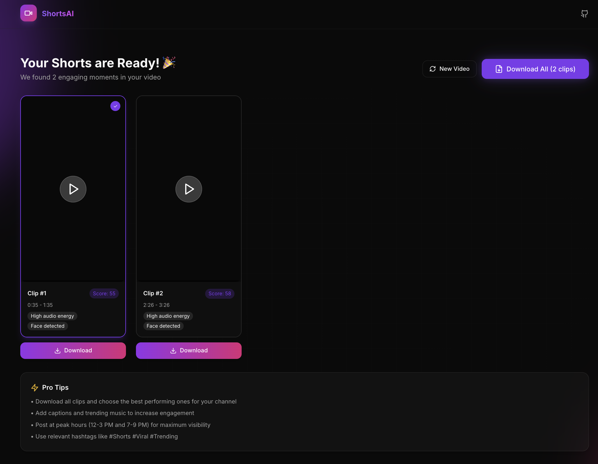
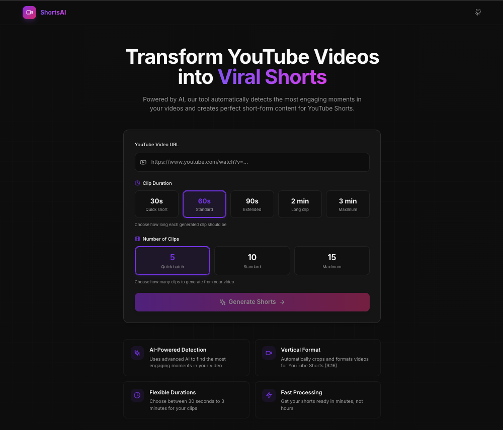

# YouTube to Shorts AI Generator

<div align="center">


**Transform YouTube videos into viral short-form clips using AI-powered scene detection**

[](https://python.org)
[](https://reactjs.org)
[](https://fastapi.tiangolo.com)
[](https://docker.com)
[](https://opensource.org/licenses/MIT)
[](https://github.com/yourusername/youtube-to-shorts-ai/actions)

</div>

---

## 🚀 Quick Start

```bash
# Clone the repository
git clone https://github.com/ShivashishY/ShortsAI.git
cd youtube-to-shorts-ai

# macOS: Double-click setup.command OR run in terminal:
./setup.sh

# Windows: Double-click setup.bat OR run in PowerShell:
.\setup.ps1

# Linux: Run in terminal:
./setup.sh
```

The setup script automatically installs all dependencies (Python, Node.js, FFmpeg, Ollama) and starts the application.

📍 **Frontend**: http://localhost:3000 | **Backend**: http://localhost:8000 | **API Docs**: http://localhost:8000/docs

---

## 🎨 Screenshots

<div align="center">

| Dark Mode | Light Mode |
|-----------|------------|
|  |  |

</div>


## Table of Contents

- [Quick Start](#-quick-start)
- [Overview](#overview)
- [How It Works](#how-it-works)
  - [User Flow](#user-flow)
  - [Processing Pipeline](#processing-pipeline)
  - [AI Detection Algorithm](#ai-detection-algorithm)
- [Features](#features)
- [Tech Stack](#tech-stack)
- [Project Structure](#project-structure)
- [Installation](#installation)
  - [Prerequisites](#prerequisites)
  - [One-Click Setup](#one-click-setup-recommended)
  - [Docker Setup](#quick-start-with-docker)
  - [Manual Setup](#manual-setup)
- [Configuration](#configuration)
- [API Documentation](#api-documentation)
- [Frontend Components](#frontend-components)
- [Troubleshooting](#troubleshooting)
- [Contributing](#contributing)
- [License](#license)

---

## Overview

YouTube to Shorts AI Generator is a full-stack application that automatically extracts the most engaging moments from YouTube videos and converts them into vertical short-form clips optimized for platforms like YouTube Shorts, TikTok, and Instagram Reels.

The application uses multiple AI-powered analysis techniques to identify high-engagement moments including:
- Audio energy peaks (music drops, applause, laughter)
- Motion intensity (action sequences)
- Face detection (close-ups, reactions)
- Scene changes (visual transitions)

---

## How It Works

### User Flow

```
┌─────────────────────────────────────────────────────────────────────────────┐
│                              USER INTERFACE                                  │
├─────────────────────────────────────────────────────────────────────────────┤
│                                                                             │
│  1. PASTE URL          2. SELECT OPTIONS        3. GENERATE & DOWNLOAD     │
│  ┌─────────────────┐   ┌─────────────────────┐   ┌─────────────────────┐   │
│  │ YouTube URL     │   │ Duration: 30s-180s  │   │ ▶ Preview Clips     │   │
│  │ Validation      │──▶│ Clip Count: 5/10/15 │──▶│ ⬇ Download MP4     │   │
│  │ Format Check    │   │ Quality Settings    │   │ 📦 Batch Download   │   │
│  └─────────────────┘   └─────────────────────┘   └─────────────────────┘   │
│                                                                             │
└─────────────────────────────────────────────────────────────────────────────┘
```

1. **Enter YouTube URL**: Paste any YouTube video URL (supports standard, short, and embed formats)
2. **Select Duration**: Choose clip length (30, 60, 90, 120, or 180 seconds)
3. **Select Clip Count**: Choose number of clips to generate (5, 10, or 15)
4. **Click Generate**: The AI analyzes the video and finds the best moments
5. **Preview & Download**: Preview clips in-browser and download the ones you like

### Processing Pipeline

```
┌──────────────────────────────────────────────────────────────────────────────┐
│                           BACKEND PROCESSING                                  │
├──────────────────────────────────────────────────────────────────────────────┤
│                                                                              │
│  ┌────────────┐    ┌────────────┐    ┌────────────┐    ┌────────────┐       │
│  │   QUEUE    │    │  DOWNLOAD  │    │  ANALYZE   │    │  PROCESS   │       │
│  │            │───▶│            │───▶│            │───▶│            │       │
│  │ Job Created│    │ yt-dlp     │    │ AI Engine  │    │ FFmpeg     │       │
│  │ UUID       │    │ Best       │    │ Multi-     │    │ Crop 9:16  │       │
│  │ Generated  │    │ Quality    │    │ Signal     │    │ Encode     │       │
│  └────────────┘    └────────────┘    └────────────┘    └────────────┘       │
│       0%               10-25%            30-60%            60-100%           │
│                                                                              │
└──────────────────────────────────────────────────────────────────────────────┘
```

**Step-by-Step Pipeline:**

| Step | Progress | Description |
|------|----------|-------------|
| **1. Queue** | 0% | Job is created with unique UUID, added to processing queue |
| **2. Download** | 10-25% | Video downloaded from YouTube using yt-dlp with optimal quality settings |
| **3. Analyze** | 30-60% | AI engine runs 5 parallel analysis methods including Ollama vision AI |
| **4. Process** | 60-100% | Top segments extracted, cropped to 9:16, encoded with FFmpeg |
| **5. Complete** | 100% | Clips ready for preview and download |

### AI Detection Algorithm

The AI detection system uses a **multi-signal fusion approach** with 5 independent analysis methods. When Ollama is available, it provides the highest-weighted analysis using vision AI:

```
┌─────────────────────────────────────────────────────────────────────────────┐
│                         AI DETECTION ENGINE                                  │
├─────────────────────────────────────────────────────────────────────────────┤
│                                                                             │
│                    ┌─────────────────────────┐                              │
│                    │   OLLAMA CONTENT AI     │                              │
│                    │   ─────────────────────  │                              │
│                    │   • LLaVA Vision Model  │                              │
│                    │   • Semantic Analysis   │                              │
│                    │   • Viral Potential     │                              │
│                    │   • Content Type        │                              │
│                    │                         │                              │
│                    │   Weight: 30%           │                              │
│                    └───────────┬─────────────┘                              │
│                                │                                            │
│  ┌─────────────────┐   ┌───────▼───────┐   ┌─────────────────┐             │
│  │  AUDIO ANALYSIS │   │ SCORE FUSION  │   │ MOTION ANALYSIS │             │
│  │  ──────────────  │   │ ───────────── │   │  ──────────────  │             │
│  │  • RMS Energy   │   │               │   │  • Optical Flow │             │
│  │  • Onset Peaks  │──▶│  Combined =   │◀──│  • Frame Diff   │             │
│  │  • Beat Detect  │   │  Ollama×0.30  │   │  • Action Score │             │
│  │                 │   │  Audio×0.20   │   │                 │             │
│  │  Weight: 20%    │   │  Motion×0.20  │   │  Weight: 20%    │             │
│  └─────────────────┘   │  Scene×0.15   │   └─────────────────┘             │
│                        │  Faces×0.15   │                                    │
│  ┌─────────────────┐   │               │   ┌─────────────────┐             │
│  │  SCENE ANALYSIS │   └───────────────┘   │  FACE ANALYSIS  │             │
│  │  ──────────────  │          │           │  ──────────────  │             │
│  │  • Frame Diff   │──────────▶│◀──────────│  • Haar Cascade │             │
│  │  • Visual Delta │           ▼           │  • Face Count   │             │
│  │  • Transitions  │    Final Score        │  • Close-up %   │             │
│  │                 │                       │                 │             │
│  │  Weight: 15%    │                       │  Weight: 15%    │             │
│  └─────────────────┘                       └─────────────────┘             │
│                                                                             │
└─────────────────────────────────────────────────────────────────────────────┘
```

> **Note**: When Ollama is not available, the system falls back to the original 4-signal analysis with adjusted weights (Audio: 30%, Motion: 25%, Scene: 20%, Faces: 25%).

#### 1. Ollama Content Analysis (30% weight) - NEW
Uses **Ollama with LLaVA** vision model for intelligent content understanding:
- **Semantic Analysis**: Understands what's happening in each frame
- **Content Classification**: Identifies action, reaction, tutorial, entertainment content
- **Viral Potential Scoring**: Rates content for short-form platform suitability
- **Mood Detection**: Identifies exciting, funny, emotional, or informative moments
- **Person & Text Detection**: Tracks presence of people and on-screen text

```python
# Ollama analyzes frames every 3 seconds
# Response includes engagement score, description, content type, and viral potential
response = ollama.chat(model="llava", messages=[{
    'role': 'user',
    'content': analysis_prompt,
    'images': [frame_base64]
}])
```

**Engagement Score Calculation:**
```python
# Base score from visual analysis (0-100)
# + Viral potential bonus (high: +15, medium: +5)
# + Content type bonus (reaction: +12, action: +10, tutorial: +8)
final_score = min(100, base_score + viral_bonus + content_bonus)
```

#### 2. Audio Analysis (20% weight)
Uses **Librosa** for audio feature extraction:
- **RMS Energy**: Calculates root-mean-square energy per second window
- **Onset Strength**: Detects beats, impacts, and audio transients
- **Peak Detection**: Identifies music drops, applause, laughter

```python
# Scoring: Higher energy = Higher score (0-100)
rms_normalized = (rms - rms.min()) / (rms.max() - rms.min()) * 100
```

#### 3. Motion Analysis (20% weight)
Uses **OpenCV optical flow** for motion detection:
- **Farneback Optical Flow**: Dense flow calculation between frames
- **Magnitude Calculation**: Measures pixel movement intensity
- **Action Scoring**: Higher motion = more engaging content

```python
# Optical flow parameters
flow = cv2.calcOpticalFlowFarneback(prev, curr, pyr_scale=0.5, levels=3, winsize=15)
motion_score = np.mean(magnitude) * 10  # Scaled 0-100
```

#### 4. Scene Analysis (15% weight)
Uses **frame differencing** for visual interest:
- **Grayscale Conversion**: Reduces computation
- **Absolute Difference**: Measures visual change between frames
- **Transition Detection**: Identifies cuts, fades, and visual interest

```python
# Frame difference scoring
diff = cv2.absdiff(prev_frame, curr_frame)
score = np.mean(diff) / 255 * 100
```

#### 5. Face Analysis (15% weight)
Uses **Haar Cascade classifier** for face detection:
- **Face Count**: More faces can indicate group reactions
- **Face Size Ratio**: Larger faces (close-ups) score higher
- **Close-up Detection**: Identifies reaction shots

```python
# Face scoring formula
face_ratio = total_face_area / frame_area
score = min(100, face_ratio * 500 + face_count * 10)
```

#### Segment Selection Algorithm

After scoring all timestamps, the algorithm selects non-overlapping segments:

```python
def select_best_segments(segments, duration, count):
    selected = []
    min_gap = 2.0  # seconds between clips
    
    for segment in sorted_by_score:
        if len(selected) >= count:
            break
        if not overlaps_with_selected(segment, selected, duration, min_gap):
            selected.append(segment)
    
    return sorted_by_timestamp(selected)
```

---

## Features

### Core Features
| Feature | Description |
|---------|-------------|
| **AI Scene Detection** | Multi-signal analysis for finding engaging moments |
| **Vertical Formatting** | Auto-crop landscape → 9:16 (1080×1920) |
| **Flexible Durations** | 30, 60, 90, 120, or 180 second clips |
| **Batch Processing** | Generate 5, 10, or 15 clips per video |
| **Real-time Progress** | Live status updates via polling |
| **Video Caching** | Downloaded videos cached for re-processing |

### Security Features
| Feature | Description |
|---------|-------------|
| **Rate Limiting** | 5 requests per hour per IP (configurable) |
| **URL Validation** | Strict YouTube URL format validation |
| **Duration Limit** | Max 180-minute videos (configurable) |
| **Auto Cleanup** | Files deleted after 24 hours |

### Output Specifications
| Property | Value |
|----------|-------|
| **Resolution** | 1080×1920 (High) or 720×1280 (Low) |
| **Aspect Ratio** | 9:16 (vertical) |
| **Video Codec** | H.264 (libx264) |
| **Audio Codec** | AAC 128kbps |
| **Container** | MP4 (faststart enabled) |

---

## Tech Stack

### Frontend
| Technology | Purpose |
|------------|---------|
| **React 18** | UI framework with hooks |
| **Vite** | Fast build tool & dev server |
| **Tailwind CSS** | Utility-first styling |
| **Framer Motion** | Smooth animations |
| **Radix UI** | Accessible component primitives |
| **Lucide React** | Icon library |

### Backend
| Technology | Purpose |
|------------|---------|
| **FastAPI** | High-performance Python API |
| **Ollama + LLaVA** | Local AI vision model for content analysis |
| **yt-dlp** | YouTube video downloading |
| **FFmpeg** | Video processing & encoding |
| **OpenCV** | Computer vision & analysis |
| **Librosa** | Audio feature extraction |
| **MediaPipe** | (Optional) Advanced face detection |
| **SlowAPI** | Rate limiting middleware |

### Infrastructure
| Technology | Purpose |
|------------|--------|
| **Docker** | Containerization |
| **Nginx** | Reverse proxy & static files |
| **Redis** | (Optional) Job queue |
| **Ollama** | Local LLM server for AI inference |

---

## Project Structure

```
youtube-to-shorts-ai/
├── setup.command               # Double-click setup for macOS
├── setup.sh                    # One-click setup for macOS/Linux (terminal)
├── setup.ps1                   # One-click setup for Windows (PowerShell)
├── setup.bat                   # Windows batch launcher for setup.ps1
├── start.command               # Double-click start for macOS
├── start.sh                    # Quick start for macOS/Linux (terminal)
├── start.bat                   # Quick start for Windows
├── docker-compose.yml          # Multi-container orchestration
├── README.md                   # Documentation
│
├── backend/
│   ├── Dockerfile              # Backend container config
│   ├── requirements.txt        # Python dependencies
│   ├── server.py               # FastAPI application entry
│   │
│   ├── services/
│   │   ├── ai_detector.py      # Multi-signal AI analysis engine
│   │   ├── ollama_analyzer.py  # Ollama/LLaVA content analysis
│   │   ├── video_processor.py  # FFmpeg video processing
│   │   └── youtube_downloader.py # yt-dlp download service
│   │
│   ├── utils/
│   │   ├── cleanup.py          # Temp file management
│   │   └── validators.py       # URL validation helpers
│   │
│   └── temp/
│       ├── downloads/          # Cached YouTube videos
│       └── outputs/            # Generated clips by job ID
│
└── frontend/
    ├── Dockerfile              # Frontend container config
    ├── package.json            # Node dependencies
    ├── vite.config.js          # Vite configuration
    ├── tailwind.config.js      # Tailwind CSS config
    ├── nginx.conf              # Production server config
    │
    └── src/
        ├── App.jsx             # Main application component
        ├── main.jsx            # React entry point
        ├── index.css           # Global styles
        │
        ├── components/
        │   ├── URLInput.jsx         # YouTube URL input
        │   ├── DurationSelector.jsx # Clip duration picker
        │   ├── ClipCountSelector.jsx # Number of clips picker
        │   ├── ProcessingStatus.jsx # Progress display
        │   ├── VideoPreview.jsx     # Clip preview player
        │   ├── DownloadButton.jsx   # Download controls
        │   │
        │   └── ui/                  # Reusable UI components
        │       ├── button.jsx
        │       ├── card.jsx
        │       ├── input.jsx
        │       ├── progress.jsx
        │       ├── select.jsx
        │       └── magic.jsx        # Animated backgrounds
        │
        └── lib/
            ├── api.js          # Backend API client
            └── utils.js        # Utility functions
```

---

## Installation

### One-Click Setup (Recommended)

We provide automated setup scripts that install all dependencies and run the project with **zero manual configuration**.

#### macOS
```bash
# Clone the repository
git clone https://github.com/ShivashishY/ShortsAI.git
cd youtube-to-shorts-ai

# Option 1: Double-click setup.command in Finder

# Option 2: Run in Terminal
./setup.sh
```

#### Linux
```bash
# Clone the repository
git clone https://github.com/ShivashishY/ShortsAI.git
cd youtube-to-shorts-ai

# Run the setup script (installs everything and starts the app)
./setup.sh
```

#### Windows
```powershell
# Clone the repository
git clone https://github.com/ShivashishY/ShortsAI.git
cd youtube-to-shorts-ai

# Option 1: Double-click setup.bat

# Option 2: Run in PowerShell (as Administrator recommended)
.\setup.ps1
```

**What the setup script does:**
1. Installs Python 3.11+, Node.js 18+, FFmpeg (via Homebrew/apt/Chocolatey)
2. Installs Ollama and downloads the LLaVA AI model (~4.7GB)
3. Creates Python virtual environment and installs backend dependencies
4. Installs frontend npm packages
5. Starts Ollama, backend, and frontend servers
6. Opens the app in your default browser

### Quick Start (After Setup)

Once setup is complete, use these scripts to run the project:

#### macOS
- **Double-click** `start.command` in Finder, or run in Terminal:
```bash
./start.sh
```

#### Linux
```bash
./start.sh
```

#### Windows
```batch
start.bat
```

---

### Manual Installation

If you prefer manual setup or the automated scripts don't work for your system:

#### Prerequisites

- **Python 3.11+** (for backend)
- **Node.js 18+** (for frontend)
- **FFmpeg** (required for video processing)
- **Ollama** (for AI content analysis)

#### Installing FFmpeg

**macOS:**
```bash
brew install ffmpeg
```

**Ubuntu/Debian:**
```bash
sudo apt update && sudo apt install ffmpeg
```

**Windows:**
```bash
# Using Chocolatey
choco install ffmpeg

# Or download from https://ffmpeg.org/download.html
```

#### Installing Ollama (Required for AI Content Analysis)

Ollama runs AI models locally for intelligent content detection.

**macOS:**
```bash
# Install Ollama
brew install ollama

# Start Ollama server
ollama serve

# Pull the LLaVA vision model (in another terminal)
ollama pull llava
```

**Linux:**
```bash
# Install Ollama
curl -fsSL https://ollama.com/install.sh | sh

# Start Ollama server
ollama serve

# Pull the LLaVA vision model (in another terminal)
ollama pull llava
```

**Windows:**
Download from [ollama.com](https://ollama.com/download) and install. Then:
```bash
# Start Ollama server
ollama serve

# Pull the LLaVA vision model
ollama pull llava
```

> **Note**: The LLaVA model (~4.7GB) enables vision-based content analysis. The system will gracefully fall back to traditional analysis methods if Ollama is unavailable.

### Quick Start with Docker

```bash
# Clone the repository
git clone https://github.com/ShivashishY/ShortsAI.git
cd youtube-to-shorts-ai

# Start with Docker Compose
docker compose up --build

# Access the app
# Frontend: http://localhost:80
# Backend API: http://localhost:8000
```

### Manual Setup (Development)

#### Backend Setup

```bash
# Navigate to backend
cd backend

# Create virtual environment
python3 -m venv venv
source venv/bin/activate  # On Windows: venv\Scripts\activate

# Install dependencies
pip install -r requirements.txt

# Start the server
uvicorn server:app --reload --host 0.0.0.0 --port 8000
```

#### Frontend Setup

```bash
# Navigate to frontend (in new terminal)
cd frontend

# Install dependencies
npm install

# Start development server
npm run dev

# Access at http://localhost:3000
```

---

## Configuration

### Environment Variables

| Variable | Default | Description |
|----------|---------|-------------|
| `TEMP_DIR` | `./temp` | Directory for temporary files |
| `MAX_VIDEO_DURATION` | `10800` | Max video length in seconds (180 min) |
| `CORS_ORIGINS` | `http://localhost:3000,http://localhost:5173` | Allowed CORS origins |
| `OLLAMA_HOST` | `http://localhost:11434` | Ollama server URL |
| `OLLAMA_MODEL` | `llava` | Vision model for content analysis |

### Rate Limiting

The API is rate-limited to prevent abuse:
- **Default**: 5 requests per hour per IP
- **Configurable** via `@limiter.limit()` decorator in `server.py`

### Video Processing Options

| Option | Values | Description |
|--------|--------|-------------|
| **Duration** | 30, 60, 90, 120, 180 | Clip length in seconds |
| **Clip Count** | 5, 10, 15 | Number of clips to generate |
| **Quality** | High/Low | 1080×1920 or 720×1280 output |

---

## API Documentation

### Base URL
- **Development**: `http://localhost:8000`
- **Production**: Configured via reverse proxy

### Endpoints

#### `GET /`
Health check endpoint.

**Response:**
```json
{
  "status": "healthy",
  "service": "YouTube to Shorts AI Generator"
}
```

---

#### `POST /api/process-video`
Start a new video processing job.

**Rate Limit:** 5 requests/hour per IP

**Request Body:**
```json
{
  "url": "https://www.youtube.com/watch?v=dQw4w9WgXcQ",
  "duration": 60,
  "clip_count": 5
}
```

| Field | Type | Required | Description |
|-------|------|----------|-------------|
| `url` | string | Yes | Valid YouTube URL |
| `duration` | int | No | Clip duration (30/60/90/120/180). Default: 60 |
| `clip_count` | int | No | Number of clips (5/10/15). Default: 5 |

**Response:**
```json
{
  "jobId": "550e8400-e29b-41d4-a716-446655440000",
  "status": "queued"
}
```

---

#### `GET /api/status/{job_id}`
Get the status of a processing job.

**Response (Processing):**
```json
{
  "jobId": "550e8400-e29b-41d4-a716-446655440000",
  "status": "analyzing",
  "progress": 45,
  "message": "Analyzing video for engaging moments...",
  "clips": null,
  "error": null
}
```

**Response (Completed):**
```json
{
  "jobId": "550e8400-e29b-41d4-a716-446655440000",
  "status": "completed",
  "progress": 100,
  "message": "Successfully generated 5 clips!",
  "clips": [
    {
      "index": 1,
      "start_time": 45.0,
      "end_time": 105.0,
      "score": 78.5,
      "filename": "clip_1.mp4",
      "reasons": ["High audio energy", "Face detected"]
    }
  ],
  "error": null
}
```

**Status Values:**
| Status | Description |
|--------|-------------|
| `queued` | Job waiting to start |
| `downloading` | Downloading video from YouTube |
| `analyzing` | AI analyzing video for engaging moments |
| `processing` | Extracting and encoding clips |
| `completed` | All clips ready |
| `failed` | Error occurred |

---

#### `GET /api/preview/{job_id}/{clip_index}`
Stream a clip for in-browser preview.

**Response:** Video file stream (`video/mp4`)

---

#### `GET /api/download/{job_id}/{clip_index}`
Download a generated clip.

**Response:** File download (`video/mp4`)
- Filename: `short_clip_{index}.mp4`

---

#### `DELETE /api/job/{job_id}`
Delete a job and its associated files.

**Response:**
```json
{
  "message": "Job deleted successfully"
}
```

---

## Frontend Components

### Component Architecture

```
App.jsx
├── URLInput.jsx           # YouTube URL input with validation
├── DurationSelector.jsx   # Duration dropdown (30-180s)
├── ClipCountSelector.jsx  # Clip count selector (5/10/15)
├── ProcessingStatus.jsx   # Progress bar with status messages
├── VideoPreview.jsx       # Video player for clip preview
└── DownloadButton.jsx     # Individual and batch download
```

### State Management

The application uses React hooks for state management:

```javascript
// Form state
const [url, setUrl] = useState("");
const [duration, setDuration] = useState(60);
const [clipCount, setClipCount] = useState(5);

// Processing state
const [jobId, setJobId] = useState(null);
const [status, setStatus] = useState(null);
const [isProcessing, setIsProcessing] = useState(false);

// Results state
const [clips, setClips] = useState([]);
const [selectedClip, setSelectedClip] = useState(null);
```

### API Client

Located in `src/lib/api.js`:

| Function | Description |
|----------|-------------|
| `processVideo(url, duration, clipCount)` | Start processing job |
| `getJobStatus(jobId)` | Poll job status |
| `getPreviewUrl(jobId, clipIndex)` | Get preview stream URL |
| `getDownloadUrl(jobId, clipIndex)` | Get download URL |
| `downloadClip(jobId, clipIndex)` | Trigger file download |
| `deleteJob(jobId)` | Delete job and files |

---

## Troubleshooting

### Common Issues

#### "FFmpeg not found"
```bash
# Verify installation
ffmpeg -version

# macOS
brew install ffmpeg

# Ubuntu
sudo apt install ffmpeg
```

#### "Video too long" error
The default max duration is 180 minutes. Adjust `MAX_VIDEO_DURATION` environment variable:
```bash
export MAX_VIDEO_DURATION=10800  # 180 minutes in seconds
```

#### "Rate limit exceeded"
The API limits requests to 5/hour per IP. Wait for the limit to reset or adjust in `server.py`:
```python
@limiter.limit("10/hour")  # Increase limit
```

#### "No engaging segments found"
This can happen with:
- Very short videos (< 30 seconds)
- Static content (slideshows, text-only)
- Audio-only content

#### Ollama not working / "Ollama not available"
```bash
# Check if Ollama is installed
ollama --version

# Check if Ollama server is running
curl http://localhost:11434/api/tags

# Start Ollama server
ollama serve

# Check if LLaVA model is downloaded
ollama list

# Download LLaVA model if missing
ollama pull llava
```

> The system will automatically fall back to traditional analysis (audio, motion, scene, face detection) if Ollama is unavailable.

#### Ollama is slow / consuming too much memory
LLaVA requires ~8GB RAM. For lower-end systems:
```bash
# Use a smaller model (less accurate but faster)
export OLLAMA_MODEL=llava:7b

# Or disable Ollama entirely (uses traditional analysis only)
# Set in backend/services/ai_detector.py: AIDetector(use_ollama=False)
```

#### Setup script fails on Linux
If the automated setup fails:
```bash
# Check which package manager you have
which apt dnf pacman

# Ubuntu/Debian manual install
sudo apt update && sudo apt install -y python3 python3-pip python3-venv nodejs npm ffmpeg

# Fedora manual install  
sudo dnf install -y python3 python3-pip nodejs npm ffmpeg

# Arch manual install
sudo pacman -S python python-pip nodejs npm ffmpeg
```

#### CORS errors in browser
Ensure the frontend URL is in `CORS_ORIGINS`:
```bash
export CORS_ORIGINS="http://localhost:3000,http://localhost:5173"
```

#### Download fails on private/age-restricted videos
yt-dlp cannot access:
- Private videos
- Age-restricted videos (without authentication)
- Region-locked content

### Logs

Backend logs are output to stdout. For detailed debugging:
```bash
# Run with debug logging
LOG_LEVEL=DEBUG uvicorn server:app --reload
```

---

## Contributing

We welcome contributions! Please see our [Contributing Guide](CONTRIBUTING.md) for details.

**Quick steps:**
1. Fork the repository
2. Create a feature branch (`git checkout -b feature/amazing-feature`)
3. Commit changes (`git commit -m 'Add amazing feature'`)
4. Push to branch (`git push origin feature/amazing-feature`)
5. Open a Pull Request

Please read our [Code of Conduct](CODE_OF_CONDUCT.md) before contributing.

---

## License

This project is licensed under the MIT License

---

<div align="center">

**Made with ❤️ for content creators**

[](https://github.com/yourusername/youtube-to-shorts-ai)

[Report Bug](https://github.com/yourusername/youtube-to-shorts-ai/issues) · [Request Feature](https://github.com/yourusername/youtube-to-shorts-ai/issues) · [Documentation](https://github.com/yourusername/youtube-to-shorts-ai/wiki)

</div>

</div>
